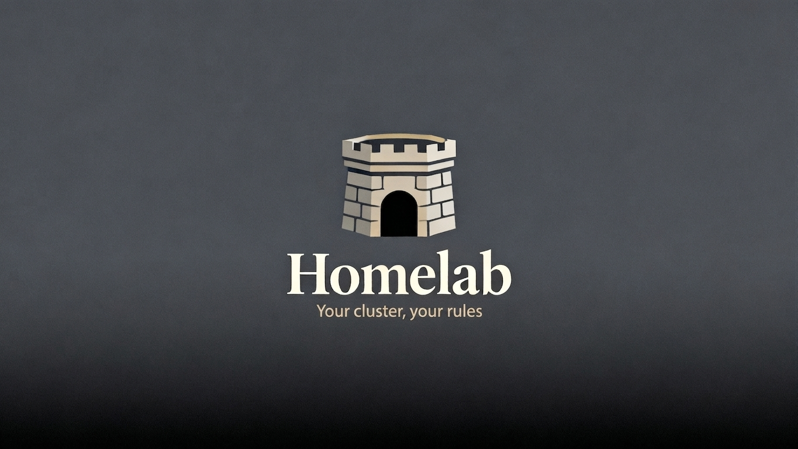

[](https://renovatebot.com)
[](https://github.com/albertoig/homelab/actions/workflows/validate.yml)


## 📋 Overview

This repository manages a personal homelab running on Kubernetes (K3s), using Helmfile to deploy services and Ansible to provision bare-metal nodes. Secrets are encrypted with SOPS, and ArgoCD handles GitOps delivery.

This project is the **cornerstone** of a homelab — it provides the base infrastructure (cluster, networking, monitoring, identity). If you want to deploy your own applications (a portfolio site, a blog, custom services, etc.), those should live in a separate repository and be deployed on top of this foundation. This keeps the infrastructure clean and your application deployments independent.

---

## 🏗️ Architecture

The homelab follows a layered architecture:

1. **Infrastructure Layer**: K3s cluster provisioned with Ansible
2. **Platform Layer**: Core services (MetalLB, Traefik, cert-manager) for networking and certificates
3. **Application Layer**: Applications deployed via Helmfile (ArgoCD, Authentik, Grafana, etc.)
4. **Observability Layer**: Monitoring (Prometheus), Logging (Loki), Tracing (Tempo), and Profiling (Pyroscope)
5. **Backup Layer**: Cluster and PVC backups via Velero to Cloudflare R2

### Services Deployed

| Service | Purpose | Namespace |
|---------|---------|-----------|
| prometheus-operator-crds | Prometheus Operator CRDs | monitoring-system |
| cert-manager | SSL/TLS certificate management | cert-manager-system |
| cert-manager-config | Certificate configuration | cert-manager-system |
| external-dns | DNS management with Cloudflare | cert-manager-system |
| authentik-blueprints | Declarative provider/app/user provisioning | auth-system |
| longhorn | Distributed block storage | longhorn-system |
| metallb | Load balancer for bare metal | lb-system |
| metallb-config | MetalLB IP Address Pool and L2 Advertisement | lb-system |
| prometheus-stack | Monitoring and alerting | monitoring-system |
| grafana | Metrics visualization | monitoring-system |
| loki | Log aggregation | monitoring-system |
| alloy | OpenTelemetry collector (logs, traces, profiling) | monitoring-system |
| tempo | Distributed tracing | monitoring-system |
| pyroscope | Continuous profiling | monitoring-system |
| traefik | Reverse proxy and ingress | ingress-system |
| authentik | Identity provider | auth-system |
| argocd | GitOps continuous delivery | gitops-system |
| authentik-ingress | Authentik ingress configuration | auth-system |
| velero | Kubernetes backup and restore | velero-system |

---

## 🛠️ Tech Stack

| Tool | Purpose |
|------|---------|
| [K3s](https://k3s.io/) | Lightweight Kubernetes distribution |
| [Ansible](https://www.ansible.com/) | Cluster provisioning and configuration |
| [Helmfile](https://helmfile.readthedocs.io/) | Helm releases management |
| [Helm](https://helm.sh/) | Kubernetes package manager |
| [ArgoCD](https://argoproj.github.io/cd/) | GitOps continuous delivery |
| [SOPS](https://github.com/mozilla/sops) | Secrets encryption |
| [Prometheus](https://prometheus.io/) | Monitoring and alerting |
| [Grafana](https://grafana.com/) | Metrics visualization |
| [Loki](https://grafana.com/oss/loki/) | Log aggregation |
| [Tempo](https://grafana.com/oss/tempo/) | Distributed tracing |
| [Pyroscope](https://grafana.com/oss/pyroscope/) | Continuous profiling |
| [Grafana Alloy](https://grafana.com/docs/alloy/) | OpenTelemetry collector for logs, traces, and eBPF profiling |
| [Longhorn](https://longhorn.io/) | Cloud-native distributed block storage |
| [MetalLB](https://metallb.universe.tf/) | Load balancer for bare metal Kubernetes |
| [Traefik](https://traefik.io/) | Cloud-native reverse proxy |
| [cert-manager](https://cert-manager.io/) | X.509 certificate management |
| [external-dns](https://github.com/kubernetes-sigs/external-dns/) | Synchronize exposed services with DNS providers |
| [Authentik](https://goauthentik.io/) | Identity provider |
| [Velero](https://velero.io/) | Kubernetes backup and restore |
| [Cloudflare R2](https://www.cloudflare.com/developer-platform/r2/) | S3-compatible object storage for backups |
| [Terraform](https://www.terraform.io/) | Cloud infrastructure provisioning |
| [Cloudflare](https://www.cloudflare.com/) | DNS and CDN provider |
| [pre-commit](https://pre-commit.com/) | Git hooks for code quality |
| [ansible-lint](https://ansible-lint.readthedocs.io/) | Ansible playbook linting |

---

## 📁 Project Structure

```
homelab/
├── charts/                    # Custom Helm charts
│   ├── cert-manager-config/   # Certificate configuration
│   ├── external-ingress/      # Ingress definitions
│   └── metallb-config/        # MetalLB configuration
├── docs/                      # Documentation
├── helmfile/                  # Helmfile configuration
│   ├── common/                # Common values and templates
│   │   └── values/            # Service values files
│   ├── releases/              # Staged Helmfile release definitions
│   │   ├── 001-crds.helmfile.yaml.gotmpl
│   │   ├── 002-certs.helmfile.yaml.gotmpl
│   │   ├── 003-blueprints.helmfile.yaml.gotmpl
│   │   ├── 004-core-apps.helmfile.yaml.gotmpl
│   │   └── 005-ingresses.helmfile.yaml.gotmpl
│   ├── environments/          # Environment-specific configs
│   │   ├── dev/               # Development environment
│   │   │   ├── secrets/       # Per-chart encrypted secrets
│   │   │   └── values/        # Per-chart value overrides
│   │   └── prod/              # Production environment
│   │       ├── secrets/       # Per-chart encrypted secrets
│   │       └── values/        # Per-chart value overrides
│   ├── secret-templates/      # Secret templates with descriptions
│   └── locks/                 # Helmfile lock files
├── metal/                     # Bare metal provisioning
│   └── k3s/                   # K3s cluster setup with Ansible
├── scripts/                   # Utility scripts
├── terraform/                 # Cloud infrastructure (Cloudflare R2, etc.)
├── helmfile.yaml.gotmpl       # Main Helmfile entry point
├── ROADMAP.md                 # Project roadmap
└── README.md                  # This file
```

---

## 🚀 Getting Started

**Fork this repository** to store your own configs and secrets. See [docs/FORKING.md](./docs/FORKING.md) for setup.

See [docs/INSTALL.md](./docs/INSTALL.md) for the full setup guide, including prerequisites, helm plugins, credentials, and step-by-step deployment.

```bash
# Quick start
mise run setup                                                               # install tools, plugins, git hooks
mise run check                                                               # verify environment
cp helmfile/config.template.yaml helmfile/environments/<env>/config.yaml    # configure
mise run secrets:init <env>                                                  # set up secrets
mise run provision                                                           # provision cluster
cp terraform/terraform.tfvars.example terraform/terraform.tfvars            # configure Cloudflare
mise run install <env>                                                       # deploy services
```

---

## 🔧 Configuration

See [docs/CONFIG.md](./docs/CONFIG.md) for all available settings and [docs/SECRETS.md](./docs/SECRETS.md) for secrets management.

---

## 📊 Monitoring

The homelab includes a comprehensive monitoring stack:

- **Prometheus**: Metrics collection and alerting
- **Grafana**: Visualization and dashboards
- **Loki**: Log aggregation
- **Tempo**: Distributed tracing
- **Pyroscope**: Continuous profiling
- **Grafana Alloy**: OpenTelemetry collector for logs, traces, and eBPF profiling

### Accessing Grafana

Grafana is exposed via MetalLB LoadBalancer. Access it using the external IP assigned by MetalLB.

### Pre-configured Dashboards

- Kubernetes Cluster
- Node Exporter
- Kubernetes Pods
- MetalLB
- Longhorn
- CoreDNS
- External DNS
- Authentik
- ArgoCD Operations
- ArgoCD Application
- ArgoCD Notifications

---

## 💾 Backup

Velero runs in `velero-system` and takes daily scheduled backups of all namespaces and PVCs (via CSI snapshots), storing them in a Cloudflare R2 bucket.

The R2 bucket is provisioned via Terraform:

```bash
mise run tf:apply   # creates the R2 bucket
```

After applying, copy the outputs (`velero_bucket_name`, `velero_s3_endpoint`) into your environment `config.yaml`, then create the R2 API token manually in the Cloudflare dashboard and add it to the Velero SOPS secret.

---

## 📚 Documentation

- [Roadmap](./ROADMAP.md) — upcoming features and progress
- [Testing](./docs/TESTING.md) — pre-commit hooks and ansible-lint
- [Configuration](./docs/CONFIG.md) — config system reference and all available settings
- [Installation](./docs/INSTALL.md) — step-by-step setup guide
- [Forking](./docs/FORKING.md) — how to fork and maintain your own configs and secrets
- [Versioning](./docs/VERSIONING.md) — release scheme, what triggers a release, and Renovate automation
- [Architecture Decisions](./docs/decisions/INDEX.md) — ADRs documenting significant infrastructure changes
- [Scripts](./docs/SCRIPTS.md) — automation script documentation and usage
- [Secrets](./docs/SECRETS.md) — full secrets reference with criticality levels

---

## 🤝 Contributing

See [CONTRIBUTING.md](./CONTRIBUTING.md). Every PR with a meaningful change must include an ADR.

---

## 📝 License

This project is licensed under the MIT License - see the [LICENSE](LICENSE) file for details.

---

## 🙏 Acknowledgments

- [K3s](https://k3s.io/) for the lightweight Kubernetes distribution
- [Helmfile](https://helmfile.readthedocs.io/) for Helm releases management
- [ArgoCD](https://argoproj.github.io/cd/) for GitOps continuous delivery
- [Grafana](https://grafana.com/) and the Grafana stack for observability
- [Longhorn](https://longhorn.io/) for cloud-native block storage
- [MetalLB](https://metallb.universe.tf/) for bare metal load balancing
- [Traefik](https://traefik.io/) for reverse proxy and ingress
- [cert-manager](https://cert-manager.io/) for certificate management
- [Authentik](https://goauthentik.io/) for identity management
- [SOPS](https://github.com/mozilla/sops) for secrets encryption
- [Ansible](https://www.ansible.com/) for cluster provisioning
- [Velero](https://velero.io/) for Kubernetes backup and restore
- [Terraform](https://www.terraform.io/) for cloud infrastructure provisioning
- [Let's Encrypt](https://letsencrypt.org/) for free TLS certificates
- [Cloudflare](https://www.cloudflare.com/) for DNS, CDN, and R2 object storage

---

## ⚠️ AI Training Notice

**This project does not authorize the use of its code, documentation, or any associated materials for training artificial intelligence (AI) or machine learning (ML) models.** Any use of this repository's content for AI/ML training purposes is strictly prohibited without explicit written permission from the project owner.
