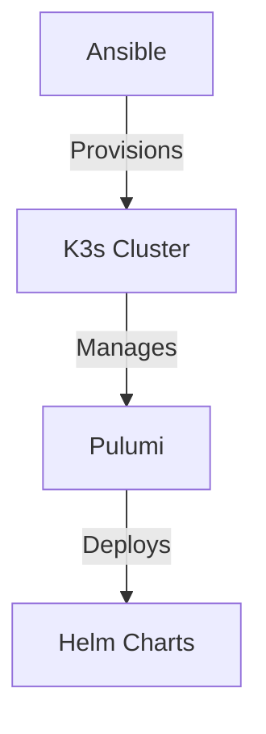

# Homelab Project Review & Recommendations

## Project Overview

This homelab project is well-structured and includes:

1. **kseed** - A Python CLI tool for Pulumi-based Kubernetes infrastructure management
2. **metal/k3s** - Ansible playbooks for provisioning K3s clusters on bare metal
3. **CI/CD pipelines** - GitHub Actions for linting, testing, security scanning, and releases
4. **Documentation** - Comprehensive guides for setup, contributing, and security

---

## Recommendations by Priority

### 🔴 High Priority

#### 1. Fix Config Directory Mismatch
The README mentions `~/.homelab/config` but the code uses `~/.kseed/config`.

| File | Path Used |
|------|-----------|
| [`kseed/kseed/config/manager.py:14`](kseed/kseed/config/manager.py:14) | `~/.kseed/config` |
| [`kseed/README.md:40`](kseed/README.md:40) | `~/.homelab/config` |

**Action**: Update the README or rename the config directory to match.

#### 2. Add Missing Tests for infra/resources.py
The [`kseed/kseed/infra/resources.py`](kseed/kseed/infra/resources.py:1) has no test coverage despite being core infrastructure code.

**Action**: Add tests for:
- `get_config_value()` - environment variable fallback
- `create_kubernetes_provider()` - different kubeconfig scenarios
- `create_namespace()` - namespace creation
- `install_nginx_ingress()` - Helm chart installation

#### 3. Add .sops.yaml to .gitignore
The SOPS configuration file [`.sops.yaml`](.sops.yaml:1) contains a hardcoded PGP key fingerprint which should not be committed.

**Action**: Add `.sops.yaml` to `.gitignore` and document how users should create their own.

#### 4. Fix Duplicate Code in commands.py
The kubeconfig extraction logic is duplicated in [`commands.py:184-225`](kseed/kseed/cli/commands.py:184) and [`checker.py:33-90`](kseed/kseed/diagnose/checker.py:33).

**Action**: Extract to a shared utility function in `kseed/kseed/utils/kubeconfig.py`.

#### 5. Add Missing Error Handling in infra/resources.py
The [`get_config_value()`](kseed/kseed/infra/resources.py:10) function returns empty string when all fallbacks fail, which could cause silent failures.

**Action**: Add explicit error handling or validation.

---

### 🟡 Medium Priority

#### 6. Add Dependabot Configuration
No automated dependency update workflow exists. The SECURITY.md mentions Dependabot but it's not configured.

**Action**: Create `.github/dependabot.yml`:
```yaml
version: 2
updates:
  - package-ecosystem: "pip"
    directory: "/kseed"
    schedule:
      interval: "weekly"
  - package-ecosystem: "github-actions"
    schedule:
      interval: "weekly"
```

#### 7. Add Pre-commit Hooks
No pre-commit configuration to catch issues before commit.

**Action**: Create `.pre-commit-config.yaml`:
```yaml
repos:
  - repo: https://github.com/astral-sh/ruff-pre-commit
    rev: v0.15.6
    hooks:
      - id: ruff
      - id: ruff-format
  - repo: https://github.com/pre-commit/pre-commit-hooks
    hooks:
      - id: trailing-whitespace
      - id: end-of-file-fixer
```

#### 8. Add CodeQL Security Scanning
The SECURITY.md mentions CodeQL but it's not configured in the CI pipeline.

**Action**: Add CodeQL workflow:
```yaml
name: CodeQL
on: [push, pull_request]

jobs:
  codeql:
    runs-on: ubuntu-latest
    steps:
      - uses: actions/checkout@v4
      - uses: github/codeql-action/init@v3
        with:
          languages: python
      - uses: github/codeql-action/analyze@v3
```

#### 9. Add Missing Type Hints in infra/resources.py
Several functions lack complete type annotations:
- [`get_config_value()`](kseed/kseed/infra/resources.py:10) - `default` parameter
- Return types on some functions

#### 10. Document Pulumi State Location in README
The [`kseed/README.md`](kseed/README.md:1) mentions state files at `~/.homelab/statefiles/{environment}.state` but this should be `~/.kseed/statefiles/`.

---

### 🟢 Low Priority

#### 11. Add Python 3.14 to CI Matrix
Consider testing against multiple Python versions for better compatibility:
```yaml
strategy:
  matrix:
    python-version: ['3.12', '3.13', '3.14']
```

#### 12. Add Integration Tests for diagnose Module
The [`tests/test_diagnose.py`](kseed/tests/test_diagnose.py:1) file is quite large (14KB) but may need more edge case coverage.

#### 13. Improve Error Messages in Ansible Script
The [`run.sh`](metal/k3s/run.sh:1) could provide more helpful error messages and suggest next steps.

#### 14. Add Ansible Linting to CI
Consider adding `ansible-lint` to the CI pipeline:
```yaml
- name: Run ansible-lint
  run: |
    ansible-lint metal/k3s/*.yml
```

#### 15. Add Architecture Diagram to README.md
The main [`README.md`](README.md:1) has an empty Architecture section - consider adding a Mermaid diagram:


#### 16. Standardize Config Directory Naming
The project uses both `~/.kseed` and mentions `~/.homelab`. Pick one and be consistent.

---

## Already Well-Implemented

The following are already done correctly:

| Area | Details |
|------|---------|
| ✅ Testing | Good coverage for config module (21 tests) |
| ✅ CI Pipeline | Comprehensive: lint, security, test jobs |
| ✅ Semantic Release | Properly configured for automated versioning |
| ✅ SOPS Integration | Encrypted inventory for K3s cluster |
| ✅ Security Scanning | Bandit + Dependency Review in CI |
| ✅ Type Hints | Most of the codebase has proper type annotations |
| ✅ Documentation | SECURITY.md, CONTRIBUTING.md, README all present |

---

## Summary

This is a well-organized homelab project with modern DevOps practices. The main areas for improvement are:

1. **Fix config path inconsistency** (high priority - confusing for users)
2. **Add tests for infra code** (high - core functionality untested)
3. **Remove PGP key from repo** (high - security risk)
4. **Add Dependabot** (medium - maintainability)
5. **Add pre-commit hooks** (medium - developer experience)

The project is in good shape overall and follows many best practices. Addressing the high-priority items will significantly improve security and user experience.
